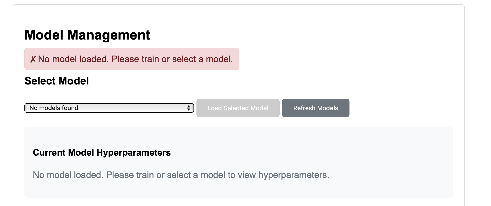
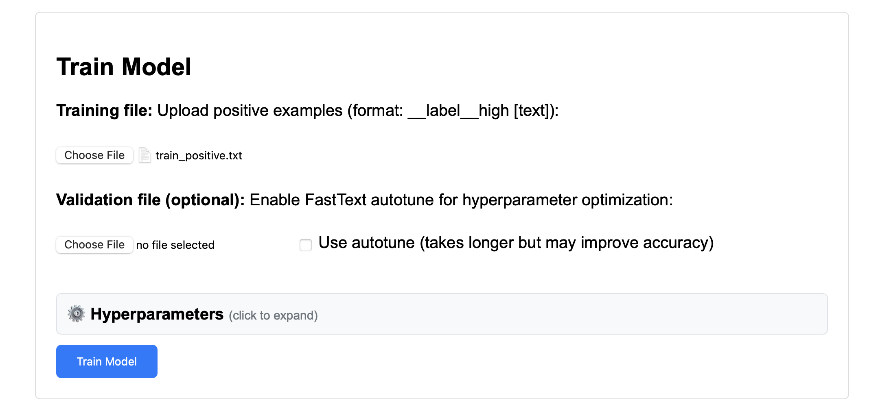
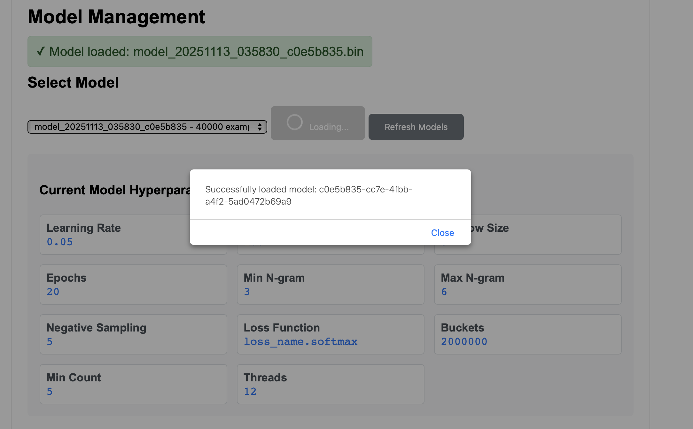
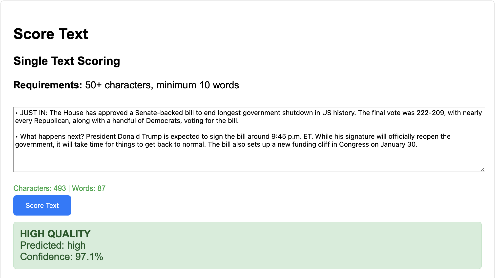
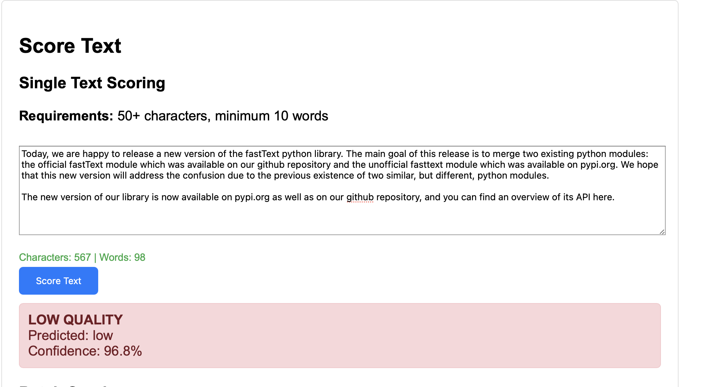
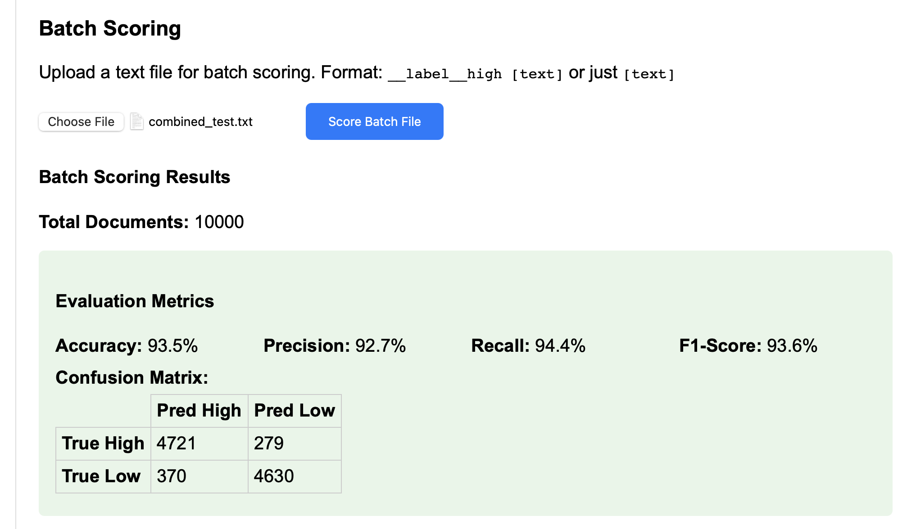
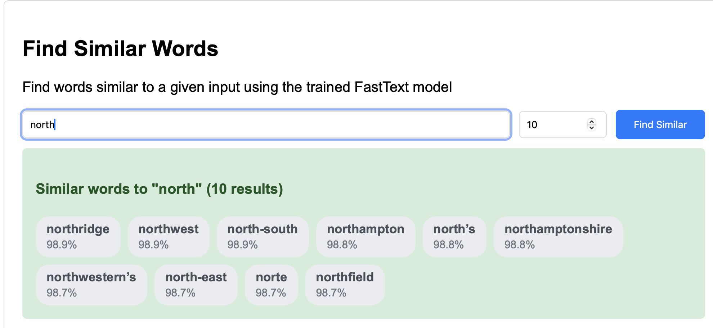

## Summary of Submission Related Information

1. The data I used for testing are from:
    [news dataset](https://huggingface.co/datasets/stanford-oval/ccnews/tree/main) for positive labels and [common crawl](https://huggingface.co/datasets/agentlans/common-crawl-sample/tree/main/en) for negative labels
   
    * I have not added the data to this repository due to its size, but you can download it to `data/raw` directory.
    * The processed data is stored in `data/processed`. Unless you want to use/test the `scripts/create_dataset.py` it should be enough for you to just upload the files from `data/processed` directory into the UI/API. 
2. I used the script from `scripts/create_datasets.py` to create the .txt files that fasttext can consume
3. The requirements.txt contains all packages required for installing. I have only tested this codebase to be working for python3.11, highly recommend you use the same as well.  
4. You could score single inputs of text, or batch (with labels) to get validation/test performance using the apis
5. Run the app using `python app.py` and access the ui using `localhost:8000/ui`
6. You can get more information from `README.md` or `docs/api_usage.md`
7. I also have a dockerfile for this app that you can refer to. However, it is much faster to run training outside the docker image (unless you want to allocate more resources by editing the `docker/docker-compose.yml` file).
* to build and run the docker image, run `docker compose up --build`
* after the build and run are successful, you will be able to access the ui in `localhost:8000/ui` 

## What to expect in the UI?

1. **Initially, you will see that no models are available.**
   
   

2. **You can train your own model, by just adding the train_positive.txt from `data/processed/train_positive.txt`**
   
   

3. **Then, go ahead and click on train (feel free to look at/edit the hyperparameters used by default)**

4. **Once the model is trained (may take a 2-3 minutes depending on hyperparams like ngrams, epochs etc.), scroll up and select your model from the dropdown and click load selected model (if it is not already selected).**
   Very rarely, training is complete but the UI is not updated (you will know training is complete when you see the model in the models/ directory). In this case, just refresh the UI please.
   
   

5. **Scroll down to `Score Text` section and input a text of your choice to view the predicted class (high vs low quality).**
   
   **High quality text example:**
   
   
   **Low quality text example:**
   

6. **Try batch scoring by uploading either `data/processed/combined_val.txt` or `data/processed/combined_test.txt` and look at performance over a val/test set.**
   
   

7. **Finally, probe the model to understand a bit more about what it has learnt, by asking for similar words from the vocabulary, to any random word!**
   
   

## Fasttext Related Information
1. The model will automatically use data that I have pre-processed from common-crawl (and stored in `data/processed/trained_negative.txt`) as the data with negative labels regardless of what you upload as the positive set. This dataset only has 20k train examples, 10k for val and 5k test examples (if you want to use other datasets, feel free to edit this file). 
2. I have enabled the ability to autotune hyperparameters using fasttext's autotune api which will tune the lr, word-ngram and char-ngram, etc. But you will need a val dataset for the same.
3. You can get performance on a batch of unseen data by uploading the val/test dataset to the batch score api.

### Design Choices
1. I have selected a random set of 20K training examples, 5k Val examples and 5k test examples as a starting point.
2. However, I have focussed more on the experiment apparatus that will allow me to easily iterate in the future. 
3. I have ensured that there is a solid validation framework in place with the following:
   
    * Batch val from a validation set with basic metrics such as precision, recall, accuracy, and confusion matrices
   
    * Examples of different failure modes
   
    * Ability to probe the model by asking for similar words and phrases
4. I also have the ability to control hyperparameters, or use fasttext's in-built autotune functionality 
5. Preprocessing of text - I have done some very basic preprocessing including making everything to lower case, converting to UTF-8 encoding, treating punctuations as separate words/tokens, etc. 

## Next Steps
1. Unit tests and api integration tests
2. Better data mining for better quality train, val and test data
3. More controllable hyperparameter tuning using grid search on our end, so that we can control what parameters are tuned. 

## Usage of LLM-Coding Assistant
I used Claude Code (3.5 sonnet) for translating some of my design ideas into code.